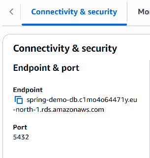

# Demo project for Spring Boot/AWS Cloud integration
The goal of the project to test what the necessary configuration are
to use a Spring Boot project with AWS resources.

The idea of the video was based on the following videos, although it 
required some fine-tuning to have the latest assets:
 - https://www.youtube.com/watch?v=Ts2a-YdN6vI
 - https://www.youtube.com/watch?v=2WwR2zbkQdQ

To run the application:
1. Create an **AWS account** (Free tier is enough).
2. Search for RDS, and create a **new Database for PostgreSQL**.
3. Make sure that the database is **Publicly accessible**, and the
    DB name is exactly what we expected (can be checked under Configuration tab).
4. On connectivity tab, we can get the necessary configuration for the connection.

5. Download **AWS CLI**, and set Access Key, Secret and zone with **aws configure**.
  You might need to create a **user group** and a **new user** under **IAM** to have
  those access keys.
6. To use those credentials, we need to set the following property:
- **spring.cloud.aws.credentials.use-default-aws-credentials-chain=true**
7. To be able to connect to the newly created db, we need to add
a new Inbound rule for the related security group with EC2. We need
our IP for that which can be checked under https://checkip.amazonaws.com/.

8. To check the connectivity, you can install PostgreSQL as well locally,
and run the following:
- **psql -h spring-demo-db.xxxxxx.eu-central-1.rds.amazonaws.com -U postgres -d postgres**
9. After the start of the application, the following should appear:
- ✅ Database connected, test query result = 1
- Process finished with exit code 0